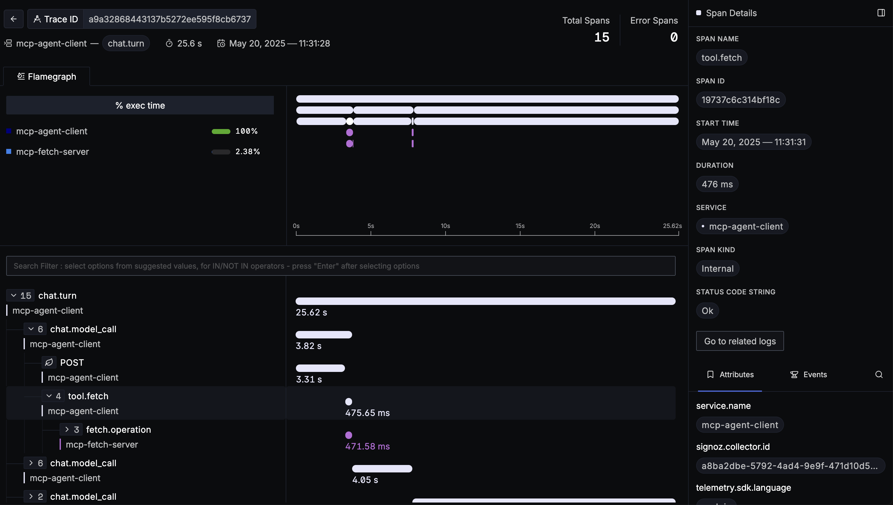
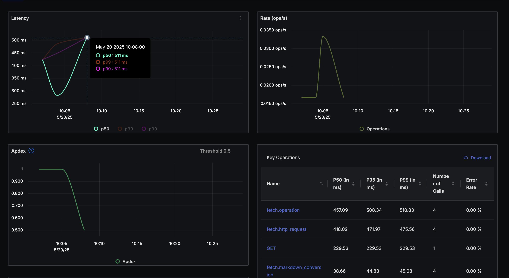

# MCP Distributed Tracing Example

This is an example project demonstrating how to do distributed tracing with an MCP enabled agent. 

The application itself is a simple Claude powered chat agent in [src/agent.ts](src/agent.ts). With multiple MCP Servers
in [src/servers](src/servers). These servers are run using the stdio transport but could be run remotely with no code changes.

Every component in the system emits [opentelemetry](https://opentelemetry.io/) data,
so any sink should be supported such as Datadog, Honeycomb, Signoz, etc.

> *Note*: this is not meant to be production code and was thrown together to experiment with trace context propagation

## Explanation

For each prompt, we start an otel [trace](https://opentelemetry.io/docs/concepts/signals/traces/) and we collect spans until the "agent"
is done processing the response, then we end the trace. This might result in multiple tool calls, responses, errors, etc.

For each component in the system, we label the spans with a "service" name. Like so:

* Agent: `mcp-agent-client`
* Fetch Server: `mcp-fetch-server`
* Calc Server: `mcp-calculator-server`

> **Note**: In a real world application, these service names would be meaningful to your application.

### Example

Prompt:

> Summarize the article on the top of Hacker News

This will make two tool calls to `fetch` which you can see in the trace:



Although we are looking at an agent trace, we can dig all the way down into the implementation details of fetch.

Having each span labeled by service also allows us to track on a service level how that MCP Server is performing:




## Explanation

This requires no changes in the spec or the clients to work. But it *creatively* reuses the `_meta` property to shuttle the
trace context at the MCP protocol level.

This looks something like this when making the tool call:

```typescript
const result = await this.client.callTool({
  name: toolUse.name,
  arguments: toolUse.arguments,
  _meta: {
    __traceContext: {
      // span here is the current span
      traceId: span.spanContext().traceId,
      spanId: span.spanContext().spanId,
      traceFlags: span.spanContext().traceFlags,
      isRemote: true
    }
  }
});
```

And like this when receiving on the server side:

```typescript
const traceContext = extra._meta?.traceContext;
// we then tell our SDK to use this trace context as the parent span
```

## Running

For a simple way to collect and explore your otel data locally, run [signoz](https://signoz.io/) using docker.

```
git clone -b main https://github.com/SigNoz/signoz.git
cd signoz/deploy/docker
docker compose up --remove-orphans -d
```

Then run the agent and chat with it:

```
export ANTHROPIC_API_KEY="sk-ant-******"
npm install
npm run build
npm start
```
